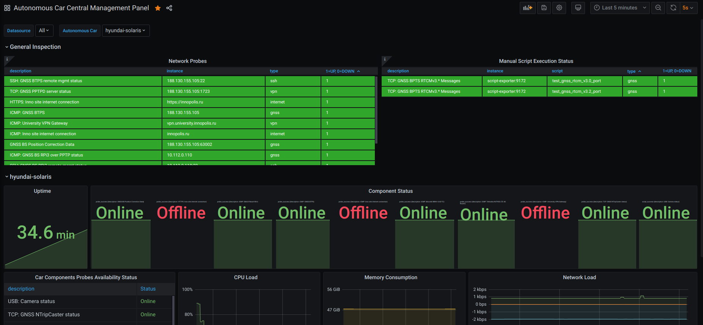
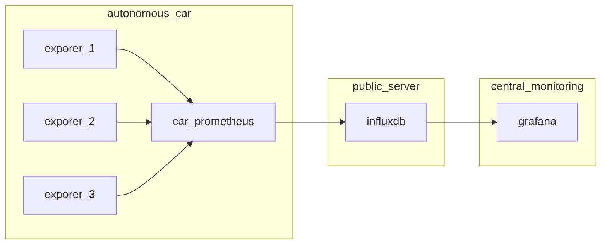
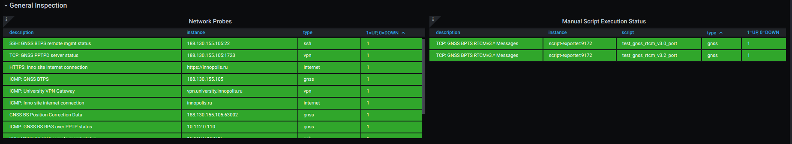
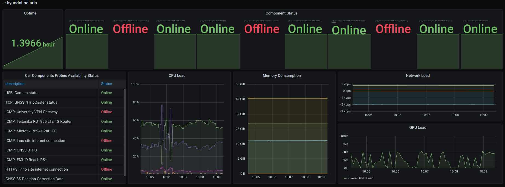

# Центр управления автономными машинами

Центр управения автономными машинами представляет собой комплекс сборщиков телеметрии, установленных на автономных машин, а также средств визуализации и наблюдения за показаниями.

- На каждой из автономных машин установлен локальный сервер мониторинга на базе стека [Prometheus+Grafana](../../../car-monitoring/README.md).
- Сервер Prometheus автономная машина выполняет удаленную запись на публичный сервер InfluxDB (текущий сервер: `BPTS: 188.130.155.105`), на котором установлен стек [InfluxDB+Grafana](../../../influxdb-public/README.md).
- На центральном сервере мониторинга (текущая страница) сервер InfluxDB настроен как источник. Дашбоард [Autonomous Car Central Management Panel](http://10.90.105.112:3000/d/wR9edzZMz/autonomous-car-central-management-panel?orgId=1&refresh=5s&var-datasource=All&var-car=hyundai-solaris&from=1592807272061&to=1592807572061) содержит метрики, касающиеся общей инфраструктуры, необходимой для корректного запуска автономных машин (GNSS Base Station), а также краткую информацию по каждой из машин.

## General Inspection

В этой секции представлена информация по общим компонентам, необходимых для запуска всех автономных машин, в том числе:

- Статус базовой стацции ГНСС приемника.
- Статус сервер ретрансляторо, с которого поправки ГНСС становятся доступны для машин.
- Статус сторонних сервисов, используемых автономными машинами

Все метрики снабжены полями "Description", в которой в краткой форме описано, как используется тот или иной компонент. Для полной корректной работы автономных машин, важно, чтобы все показатели в этой секции были в рабочем режиме (зеленый статус)

## Per-car section

Данный раздел выстаивается автоматически для каждой машины, теги которой имеют запись `car: <car-name>`, где `<car-name>` - ключевое имя для машины.

Здесь представлена следующая информация:

- Время беспрерывной работы автомобиля (Uptime)
- Статус работы компонентов (Component Status, Car Components Probes Availiability Status)
- Нагрузка на CPU
- Нагрузка на память
- Свободное место на диске
- Сетевая нагрузка
- Нагрузка на GPU

В зависимости от контекста, компонент в статусе Offline может не влиять на общую работоспособность автомобиля.

Здесь представлены не все метрики. Из-за конвертации из PromQL в InfluxDB сложно подобрать равные запросы, поэтому большая часть телетрии не отображена, но доступна для ручных запросов в разделе "Explore" в Grafana. Для полноты картины лучше использовать информацию, показанную в локальных системах мониторинга.
